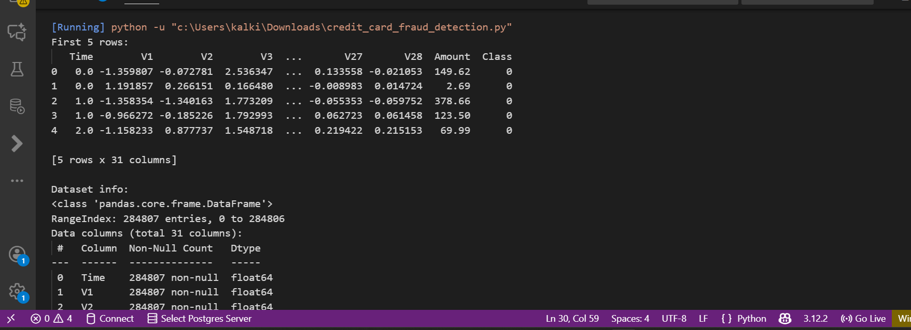
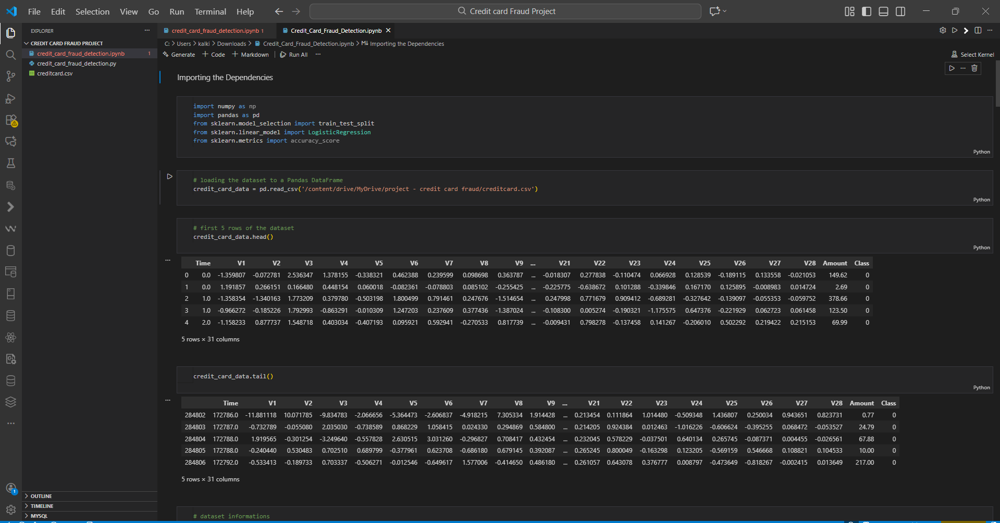
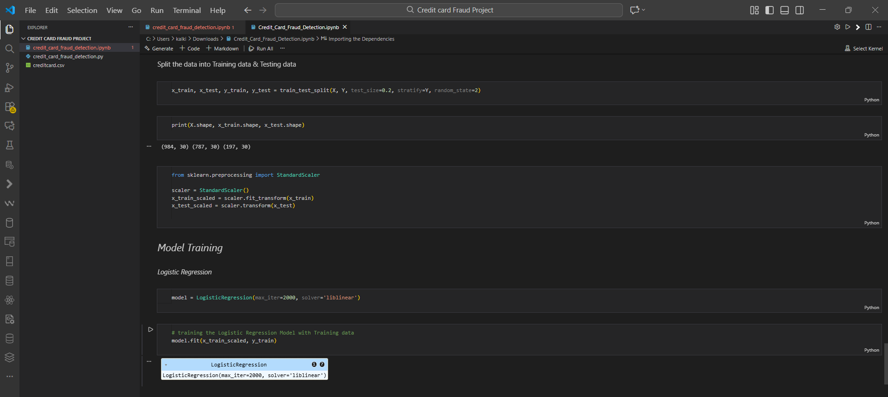

# Model Performance Report — Credit Card Fraud Detection

## 1. Dataset Overview
The dataset contains 284,807 transactions and 31 features.  
Only 492 records are labeled as fraud (0.17%).

### Dataset Head & Info

### Dataset Imports & Preview

### Dataset Info Overview

## 2. Data Quality Check
The dataset has **no missing values**.

### Missing Values Check

## 3. Class Imbalance Analysis
The dataset is highly imbalanced with a dominant legitimate class.

### Class Distribution

## 4. Under-Sampling Process
To create a balanced dataset, legitimate transactions were under-sampled from 284,315 → 492.

### Amount Statistics (Legit vs Fraud)

### Class-wise Mean Comparison & Under-Sampling

### Balanced Dataset Overview + Feature/Target Split

## 5. Feature and Target Preparation
Thirty numerical features were used as X.  
The **Class** column served as Y.

### Feature Matrix & Target Vector

## 6. Model Training
Training config:
- StandardScaler normalization  
- Train/Test Split (80/20, stratified)  
- Logistic Regression (max_iter=2000)

### Train/Test Split + Scaling + Training

## 7. Model Evaluation
Training Accuracy: **0.9555**  
Testing Accuracy: **0.9289**

### Confusion Matrix + Classification Report

## 8. Final Test Accuracy
Final accuracy on unseen data: **0.9289**

### Test Accuracy Score

